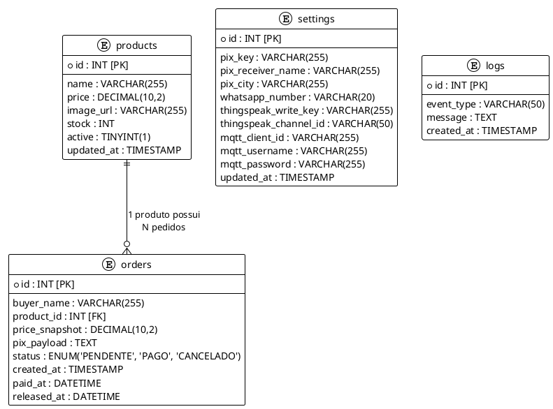

# 🚀 Fibrag Vending - Sistema Web

Este repositório contém o sistema web (Backend e Frontend) responsável pelo gerenciamento de vendas, pagamentos e acionamento remoto da Máquina de Vendas Automática (Vending Machine). O sistema atua como a ponte entre a interface de compra do usuário final e o hardware (ESP32), utilizando o **ThingSpeak** como broker MQTT.

## 📌 Visão Geral da Arquitetura

O sistema é construído em **PHP e MySQL** e funciona de forma assíncrona. O fluxo principal segue 4 etapas:
1. **Compra (Frontend):** O cliente acessa a página inicial, escolhe o produto e gera o pagamento PIX.
2. **Pagamento (Backend):** O sistema processa o pagamento e atualiza o banco de dados (Status: `PAGO`).
3. **Comando (Admin):** O painel administrativo envia uma requisição HTTP via cURL para a API REST do ThingSpeak.
4. **Hardware (IoT):** O ESP32, inscrito no canal MQTT do ThingSpeak, recebe o comando em tempo real e libera o produto físico.

---

## ✨ Funcionalidades Principais

- **Gestão de Pedidos:** Validação de status de pagamentos (`PENDENTE` -> `PAGO`).
- **Integração de Pagamento PIX:** Geração e processamento de pagamentos via módulo dedicado.
- **Controle de Estoque Remoto:** Redução automática do estoque no banco de dados após a liberação.
- **Integração IoT (ThingSpeak):** Envio seguro de comandos para a nuvem usando cURL e HTTP GET.
- **Registro Financeiro:** Envio do preço do produto para o ThingSpeak para geração de gráficos de faturamento na nuvem.
- **Segurança de Acesso:** Sistema de login e logout para proteger o painel administrativo.

---

## 📂 Estrutura de Arquivos do Projeto

```text
/
├── admin/                  # Área restrita de administração
│   ├── api.php             # Core da API RESTful local (Trata POST requests e envia p/ ThingSpeak)
│   ├── index.php           # Painel visual do administrador (Dashboard)
│   ├── login.php           # Tela e lógica de autenticação do administrador
│   ├── logout.php          # Encerramento seguro de sessão
│   ├── test_mqtt.html      # Ferramenta de teste de envio de pacotes MQTT (Front)
│   └── teste_debug.html    # Ferramenta para debug de respostas do sistema
│
├── app/                    # Lógica de negócio e integrações (Backend)
│   ├── config.php          # Configurações globais (Variáveis de ambiente, chaves, etc.)
│   ├── db.php              # Conexão PDO segura com o banco de dados MySQL
│   ├── functions.php       # Funções utilitárias e consultas gerais (Getters, formatadores)
│   ├── pix.php             # Módulo de integração e geração de cobranças PIX
│   └── thingspeak.php      # Função de integração direta com a API do ThingSpeak (cURL)
│
├── assets/                 # Arquivos estáticos globais
│   └── style.css           # Folhas de estilo (CSS) da interface web
│
├── img/                    # Imagens do sistema (Logos, fotos de produtos, ícones)
│
├── SQL/                    # Estruturas e backups do Banco de Dados
│   └── (arquivos .sql)     # Scripts para criação de tabelas (orders, products, settings)
│
└── index.php               # Página inicial (Frontend) voltada para o cliente final
```

# ⚙️ Configuração e Instalação

## 1. Requisitos do Servidor

Servidor Web (Apache/Nginx)

PHP 7.4 ou superior

Extensão cURL habilitada no PHP (obrigatório para a comunicação com o ThingSpeak)

Extensão PDO MySQL habilitada

Banco de Dados MySQL/MariaDB


## 2. Configuração Inicial

Importe os arquivos `.sql` localizados na pasta `SQL/` para o seu banco de dados MySQL para criar as tabelas **orders**, **products** e **settings**.

Renomeie ou edite o arquivo `app/config.php` com as credenciais corretas do seu banco de dados e as chaves da API de pagamento (PIX).

No painel de administração, ou diretamente no banco de dados na tabela **settings**, configure sua **thingspeak_write_key** do canal IoT.

# 🔌 Documentação da API e Integração IoT (app/thingspeak.php)

A comunicação entre o sistema web e a máquina física não ocorre via bibliotecas complexas de MQTT no PHP. Em vez disso, utilizamos a API REST do ThingSpeak. O arquivo `admin/api.php` processa a requisição interna e chama a função `sendToThingSpeak()` localizada em `app/thingspeak.php`.

A função `sendToThingSpeak($writeKey, $productId, $valor)` constrói uma URL de requisição HTTP GET exata que o ThingSpeak exige para atualizar um canal.

A estrutura da URL no código é montada da seguinte forma:


## Detalhamento dos Parâmetros Enviados

api_key é a chave de escrita (Write Key) do canal, garantindo que apenas o sistema autorizado possa enviar dados para o ThingSpeak.

field1 recebe a variável $productId (por exemplo, 16). Este campo é vital para o hardware, pois o ESP32 está inscrito especificamente no tópico associado ao field1 e utilizará esse número para identificar qual motor ou LED deve ser acionado.

field2 recebe a variável $valor (por exemplo, 5.00). Este campo envia o preço ou valor do produto liberado. Ele é ignorado pelo ESP32, porém permanece armazenado no banco de dados em nuvem do ThingSpeak para geração de gráficos de faturamento ou histórico financeiro.

status é uma string (HTTPSENT) utilizada apenas para registro de log no ThingSpeak, indicando a origem do comando enviado.

Após a montagem da URL, o PHP utiliza a biblioteca cURL para acessar essa URL em background, efetivando o envio dos dados para o ThingSpeak.


## Ações Internas (admin/api.php)

### Ação: confirm_payment

Payload esperado: order_id (INT), action ("confirm_payment").

O comportamento consiste em marcar o pedido como PAGO e atualizar o campo paid_at com a data e hora da confirmação.


### Ação: release_product

Payload esperado: order_id (INT), action ("release_product").

O comportamento verifica inicialmente se o status do pedido é PAGO. Caso seja verdadeiro, o sistema extrai o $productId e o $preco, acionando então a função sendToThingSpeak() para liberar o produto fisicamente.


## Controle de Delay

Caso o servidor do ThingSpeak retorne o valor 0, indicando que a requisição ocorreu em um intervalo inferior a 15 segundos desde o último envio, a API retorna um erro ao usuário e não registra a liberação no banco de dados. Esse mecanismo protege o sistema contra violações do limite imposto pelo plano gratuito do ThingSpeak.

# 🛡️ Segurança e Boas Práticas Implementadas

Sessões protegidas são aplicadas aos arquivos localizados na pasta `admin/`, que exigem validação de sessão ativa iniciada por meio do `login.php`, garantindo que apenas usuários autenticados possam acessar funcionalidades administrativas.

A prevenção de dupla liberação é realizada verificando o status do pedido diretamente no banco de dados. O comando que envia a requisição para a URL do ThingSpeak somente é executado quando a consulta retorna que o pedido está estritamente com o status **PAGO**, evitando execuções duplicadas ou indevidas.

A proteção SSL no cURL é configurada utilizando a diretiva `curl_setopt($ch, CURLOPT_SSL_VERIFYPEER, false)`. Essa configuração assegura que a requisição HTTP seja enviada mesmo caso o servidor de hospedagem apresente falhas ou certificados raiz desatualizados durante a comunicação com a API do ThingSpeak.

Transações seguras são implementadas utilizando PDO com blocos estruturados `try/catch` e o método `pdo->rollBack()`. Caso ocorra qualquer falha durante a execução da lógica de negócio antes da conclusão do processo, todas as alterações são revertidas automaticamente, evitando inconsistências no banco de dados.

## 🗄️ Estrutura do Banco de Dados

O sistema utiliza um banco de dados relacional MySQL (`leaote14_vending`) composto por 4 tabelas principais. Esta arquitetura foi pensada para manter o histórico de vendas seguro, gerenciar o estoque em tempo real e centralizar as configurações de APIs externas.

### Descrição das Tabelas

1. **`products` (Produtos e Estoque)**
   - Armazena o catálogo da máquina (geralmente de 1 a 16 produtos correspondentes aos motores/LEDs do ESP32).
   - Mantém o preço atual, URL da imagem e a quantidade disponível (`stock`).
   - O campo `active` permite desabilitar produtos vazios ou em manutenção sem excluí-los.

2. **`orders` (Pedidos e Transações)**
   - É o coração do sistema web. Registra toda a jornada de compra do cliente.
   - Salva quem comprou (`buyer_name`), o que comprou (`product_id`) e o preço exato no momento da compra (`price_snapshot` - evita problemas se o preço do produto mudar no futuro).
   - O campo `pix_payload` guarda o código "Copia e Cola" gerado para validação.
   - Possui controle estrito de linha do tempo: `created_at` (Geração do PIX) ➔ `paid_at` (Confirmação) ➔ `released_at` (Envio do sinal MQTT para o ESP32).

3. **`settings` (Configurações Globais)**
   - Tabela de registro único (geralmente apenas o `id = 1`) para evitar hardcode (variáveis fixas no código PHP).
   - Centraliza os dados de recebimento do PIX (`pix_key`, `pix_receiver_name`, `pix_city`).
   - Centraliza as credenciais de IoT do ThingSpeak (`thingspeak_write_key`, `thingspeak_channel_id`, senhas MQTT, etc.).

4. **`logs` (Auditoria)**
   - Tabela auxiliar para registro de eventos do sistema, erros de API externa ou tentativas de acesso, garantindo rastreabilidade (`event_type`, `message`).

---

### Diagrama Entidade-Relacionamento (ER)

Abaixo está a representação visual da estrutura do banco de dados (pode ser visualizado em visualizadores PlantUML):




